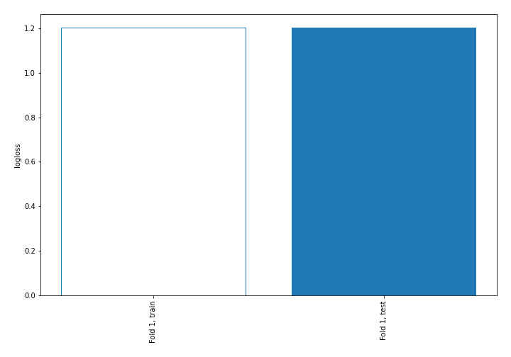
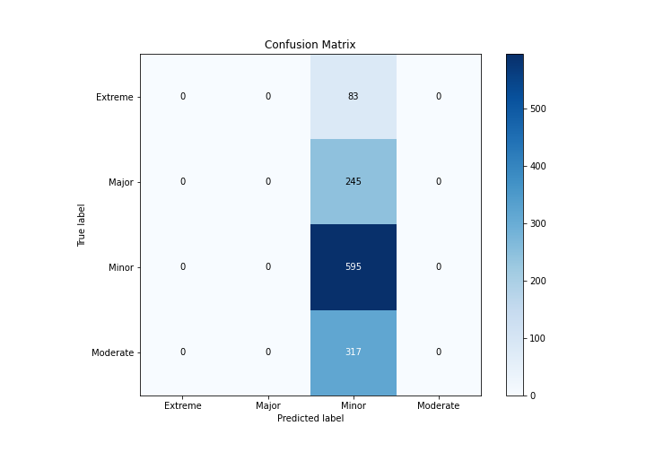
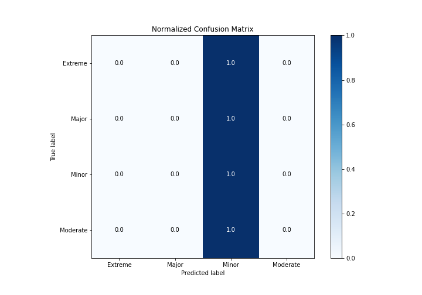
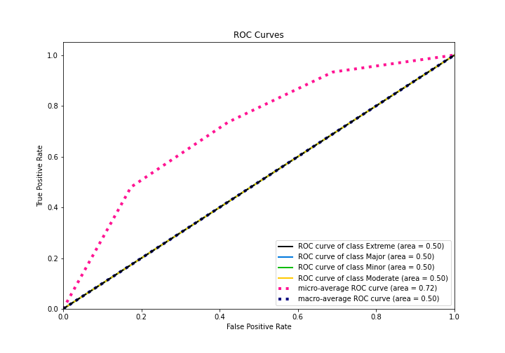
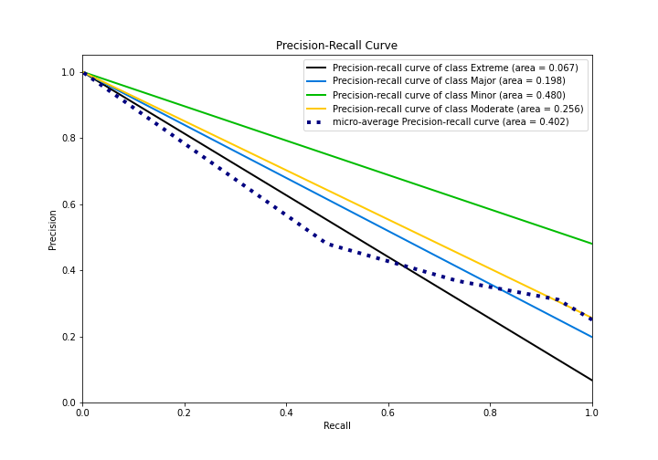

# Summary of 1_Baseline

[<< Go back](../README.md)

## Baseline Classifier (Baseline)
- **n_jobs**: -1
- **num_class**: 4
- **explain_level**: 2

## Validation
 - **validation_type**: split
 - **train_ratio**: 0.75
 - **shuffle**: True
 - **stratify**: True

## Optimized metric
logloss

## Training time

0.8 seconds

### Metric details
|           |   Extreme |   Major |      Minor |   Moderate |   accuracy |   macro avg |   weighted avg |   logloss |
|:----------|----------:|--------:|-----------:|-----------:|-----------:|------------:|---------------:|----------:|
| precision |         0 |       0 |   0.479839 |          0 |   0.479839 |    0.11996  |       0.230245 |   1.20244 |
| recall    |         0 |       0 |   1        |          0 |   0.479839 |    0.25     |       0.479839 |   1.20244 |
| f1-score  |         0 |       0 |   0.648501 |          0 |   0.479839 |    0.162125 |       0.311176 |   1.20244 |
| support   |        83 |     245 | 595        |        317 |   0.479839 | 1240        |    1240        |   1.20244 |

## Confusion matrix
|                     |   Predicted as Extreme |   Predicted as Major |   Predicted as Minor |   Predicted as Moderate |
|:--------------------|-----------------------:|---------------------:|---------------------:|------------------------:|
| Labeled as Extreme  |                      0 |                    0 |                   83 |                       0 |
| Labeled as Major    |                      0 |                    0 |                  245 |                       0 |
| Labeled as Minor    |                      0 |                    0 |                  595 |                       0 |
| Labeled as Moderate |                      0 |                    0 |                  317 |                       0 |

## Learning curves

## Confusion Matrix

## Normalized Confusion Matrix

## ROC Curve

## Precision Recall Curve

[<< Go back](../README.md)
