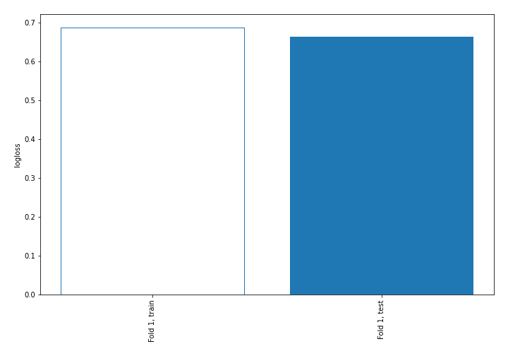

# Summary of 2_DecisionTree

[<< Go back](../README.md)

## Decision Tree
- **n_jobs**: -1
- **criterion**: gini
- **max_depth**: 3
- **num_class**: 4
- **explain_level**: 2

## Validation
 - **validation_type**: split
 - **train_ratio**: 0.75
 - **shuffle**: True
 - **stratify**: True

## Optimized metric
logloss

## Training time

20.3 seconds

### Metric details
|           |   Extreme |      Major |      Minor |   Moderate |   accuracy |   macro avg |   weighted avg |   logloss |
|:----------|----------:|-----------:|-----------:|-----------:|-----------:|------------:|---------------:|----------:|
| precision |  0.609091 |   0.589474 |   0.815988 |   0.664835 |   0.723387 |    0.669847 |       0.718743 |  0.663664 |
| recall    |  0.807229 |   0.685714 |   0.909244 |   0.381703 |   0.723387 |    0.695973 |       0.723387 |  0.663664 |
| f1-score  |  0.694301 |   0.633962 |   0.860095 |   0.48497  |   0.723387 |    0.668332 |       0.708419 |  0.663664 |
| support   | 83        | 245        | 595        | 317        |   0.723387 | 1240        |    1240        |  0.663664 |

## Confusion matrix
|                     |   Predicted as Extreme |   Predicted as Major |   Predicted as Minor |   Predicted as Moderate |
|:--------------------|-----------------------:|---------------------:|---------------------:|------------------------:|
| Labeled as Extreme  |                     67 |                   16 |                    0 |                       0 |
| Labeled as Major    |                     38 |                  168 |                   15 |                      24 |
| Labeled as Minor    |                      3 |                   14 |                  541 |                      37 |
| Labeled as Moderate |                      2 |                   87 |                  107 |                     121 |

## Learning curves

## Decision Tree 

### Tree #1

### Rules

if (APR Severity of Illness Description > 1.5) and (Age Group <= 3.5) and (Age Group <= 2.5) then class: Minor (proba: 95.18%) | based on 975 samples

if (APR Severity of Illness Description <= 1.5) and (APR Severity of Illness Code <= 3.5) and (Age Group > 2.5) then class: Major (proba: 57.79%) | based on 879 samples

if (APR Severity of Illness Description > 1.5) and (Age Group <= 3.5) and (Age Group > 2.5) then class: Minor (proba: 74.3%) | based on 603 samples

if (APR Severity of Illness Description > 1.5) and (Age Group > 3.5) and (APR Severity of Illness Code > 1.5) then class: Moderate (proba: 57.85%) | based on 567 samples

if (APR Severity of Illness Description <= 1.5) and (APR Severity of Illness Code > 3.5) and (Patient Disposition > 4.0) then class: Extreme (proba: 56.22%) | based on 233 samples

if (APR Severity of Illness Description > 1.5) and (Age Group > 3.5) and (APR Severity of Illness Code <= 1.5) then class: Minor (proba: 64.91%) | based on 228 samples

if (APR Severity of Illness Description <= 1.5) and (APR Severity of Illness Code <= 3.5) and (Age Group <= 2.5) then class: Minor (proba: 46.95%) | based on 164 samples

if (APR Severity of Illness Description <= 1.5) and (APR Severity of Illness Code > 3.5) and (Patient Disposition <= 4.0) then class: Extreme (proba: 89.86%) | based on 69 samples

## Permutation-based Importance

## Confusion Matrix

## Normalized Confusion Matrix

## ROC Curve

## Precision Recall Curve

## SHAP Importance

## SHAP Dependence plots

### Dependence Extreme (Fold 1)

### Dependence Major (Fold 1)

### Dependence Minor (Fold 1)

### Dependence Moderate (Fold 1)

## SHAP Decision plots

### Worst decisions for selected sample 1 (Fold 1)

### Worst decisions for selected sample 2 (Fold 1)

### Worst decisions for selected sample 3 (Fold 1)

### Worst decisions for selected sample 4 (Fold 1)

### Best decisions for selected sample 1 (Fold 1)

### Best decisions for selected sample 2 (Fold 1)

### Best decisions for selected sample 3 (Fold 1)

### Best decisions for selected sample 4 (Fold 1)

[<< Go back](../README.md)
