# Summary of 3_Linear

[<< Go back](../README.md)

## Logistic Regression (Linear)
- **n_jobs**: -1
- **num_class**: 4
- **explain_level**: 2

## Validation
 - **validation_type**: split
 - **train_ratio**: 0.75
 - **shuffle**: True
 - **stratify**: True

## Optimized metric
logloss

## Training time

11.5 seconds

### Metric details
|           |   Extreme |      Major |      Minor |   Moderate |   accuracy |   macro avg |   weighted avg |   logloss |
|:----------|----------:|-----------:|-----------:|-----------:|-----------:|------------:|---------------:|----------:|
| precision |  0.644444 |   0.634146 |   0.835165 |   0.610487 |   0.733065 |    0.681061 |       0.725244 |  0.621415 |
| recall    |  0.698795 |   0.636735 |   0.894118 |   0.514196 |   0.733065 |    0.685961 |       0.733065 |  0.621415 |
| f1-score  |  0.67052  |   0.635438 |   0.863636 |   0.558219 |   0.733065 |    0.681953 |       0.727544 |  0.621415 |
| support   | 83        | 245        | 595        | 317        |   0.733065 | 1240        |    1240        |  0.621415 |

## Confusion matrix
|                     |   Predicted as Extreme |   Predicted as Major |   Predicted as Minor |   Predicted as Moderate |
|:--------------------|-----------------------:|---------------------:|---------------------:|------------------------:|
| Labeled as Extreme  |                     58 |                   24 |                    0 |                       1 |
| Labeled as Major    |                     28 |                  156 |                   11 |                      50 |
| Labeled as Minor    |                      2 |                    8 |                  532 |                      53 |
| Labeled as Moderate |                      2 |                   58 |                   94 |                     163 |

## Learning curves
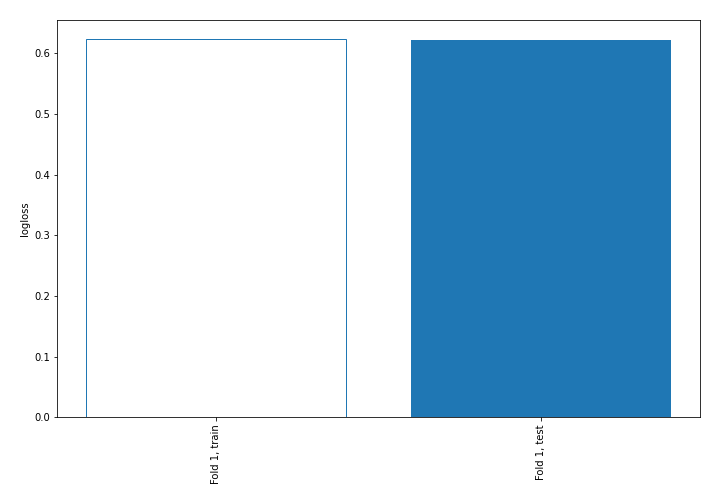

## Coefficients

### Coefficients learner #1
|                                     |     Extreme |       Major |       Minor |    Moderate |
|:------------------------------------|------------:|------------:|------------:|------------:|
| intercept                           | -5.23067    |  0.564709   |  2.41912    |  2.24684    |
| Health Service Area                 | -0.0153044  | -0.00597284 |  0.0596087  | -0.0383315  |
| Hospital County                     |  0.065615   |  0.0152761  | -0.0533957  | -0.0274955  |
| Operating Certificate Number        | -0.194199   | -0.0495815  |  0.0961094  |  0.147671   |
| Facility Id                         |  0.0651606  |  0.0357358  | -0.037161   | -0.0637354  |
| Facility Name                       |  0.00567867 | -0.0477554  |  0.0912282  | -0.0491514  |
| Age Group                           |  1.29904    |  0.706508   | -1.65491    | -0.350633   |
| Zip Code - 3 digits                 |  0.119265   | -0.0610193  | -0.0140682  | -0.0441779  |
| Gender                              |  0.134831   |  0.0387713  | -0.14447    | -0.0291325  |
| Race                                |  0.00685708 |  0.0322749  |  0.00921874 | -0.0483507  |
| Ethnicity                           |  0.198227   | -0.0717455  | -0.00631799 | -0.120164   |
| Length of Stay                      |  0.0140195  |  0.0528018  | -0.13354    |  0.0667189  |
| Type of Admission                   | -0.0551736  |  0.0790164  | -0.026742   |  0.00289918 |
| Patient Disposition                 | -0.135887   |  0.205957   | -0.15148    |  0.0814094  |
| CCS Diagnosis Code                  | -0.545843   | -0.149552   |  0.583893   |  0.111502   |
| CCS Diagnosis Description           | -0.0559129  |  0.0325011  |  0.082418   | -0.0590062  |
| CCS Procedure Code                  |  0.147576   | -0.0510445  |  0.0190545  | -0.115586   |
| CCS Procedure Description           |  0.177202   | -0.0398291  | -0.0815798  | -0.0557932  |
| APR DRG Code                        |  0.340604   |  0.0658981  | -0.219479   | -0.187022   |
| APR DRG Description                 | -0.0426926  |  0.00446023 | -0.0163889  |  0.0546213  |
| APR MDC Code                        | -0.197989   | -0.0413347  |  0.0854664  |  0.153857   |
| APR MDC Description                 |  0.0421558  | -0.0997725  |  0.172004   | -0.114387   |
| APR Severity of Illness Code        |  2.30134    |  0.735951   | -2.29463    | -0.742654   |
| APR Severity of Illness Description | -1.19816    |  0.185024   |  0.586724   |  0.426414   |
| APR Medical Surgical Description    | -0.217383   | -0.1366     |  0.304566   |  0.0494168  |
| Payment Typology 1                  |  0.0725904  |  0.0752514  | -0.13974    | -0.00810184 |
| Payment Typology 2                  | -0.0847263  |  0.0571119  |  0.0719938  | -0.0443794  |
| Payment Typology 3                  |  0.00943732 | -0.0284599  |  0.0734202  | -0.0543976  |
| Birth Weight                        | -0.442874   |  0.392776   | -0.024185   |  0.0742826  |
| Emergency Department Indicator      |  0.148377   |  0.0279708  | -0.154198   | -0.0221505  |
| Total Charges                       |  0.162107   |  0.212341   | -0.279689   | -0.0947599  |
| Total Costs                         |  0.054338   | -0.0866831  |  0.00991487 |  0.0224303  |

## Permutation-based Importance
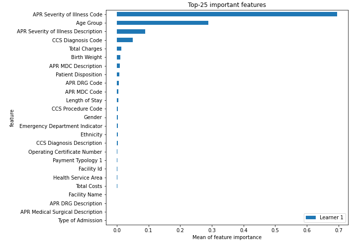
## Confusion Matrix

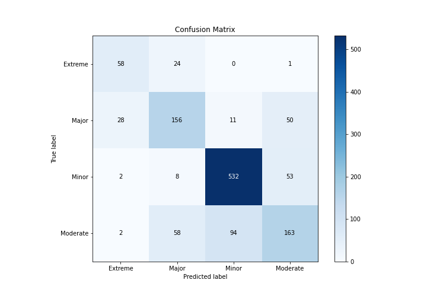

## Normalized Confusion Matrix

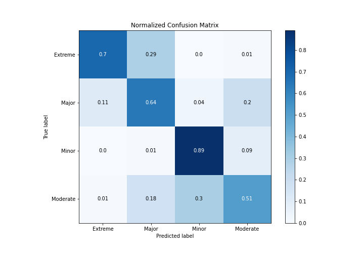

## ROC Curve

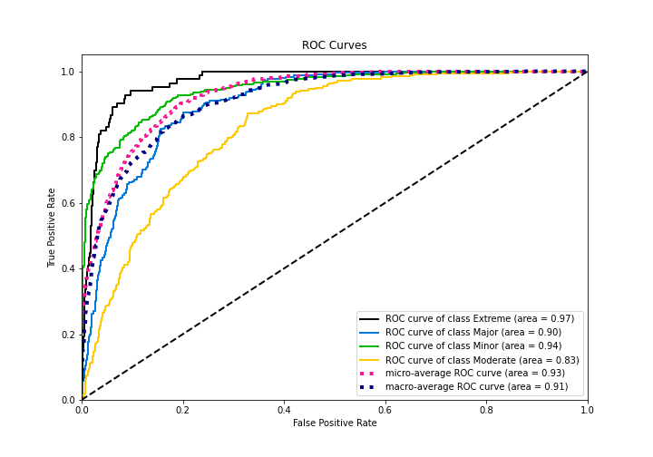

## Precision Recall Curve

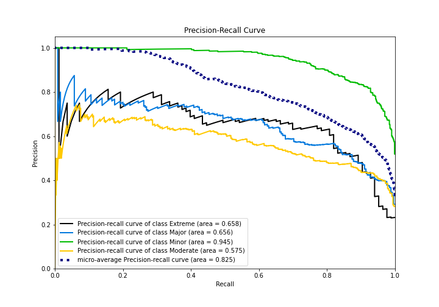

## SHAP Importance
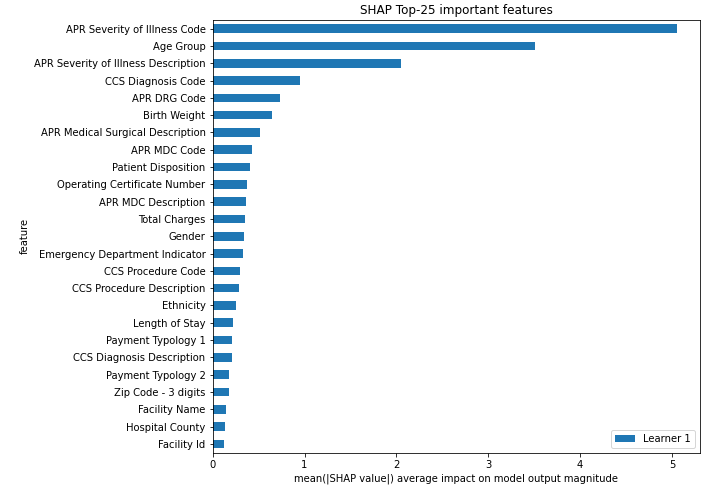

## SHAP Dependence plots

### Dependence Extreme (Fold 1)
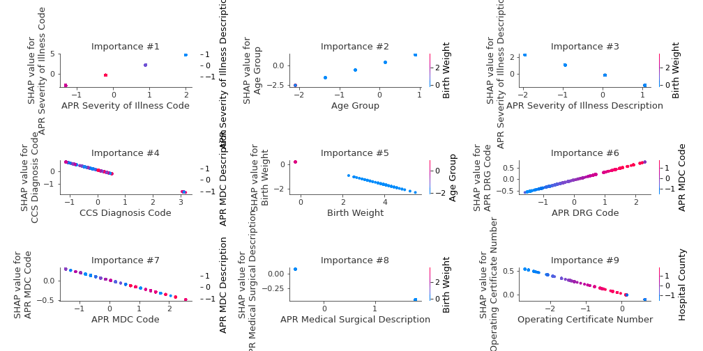
### Dependence Major (Fold 1)
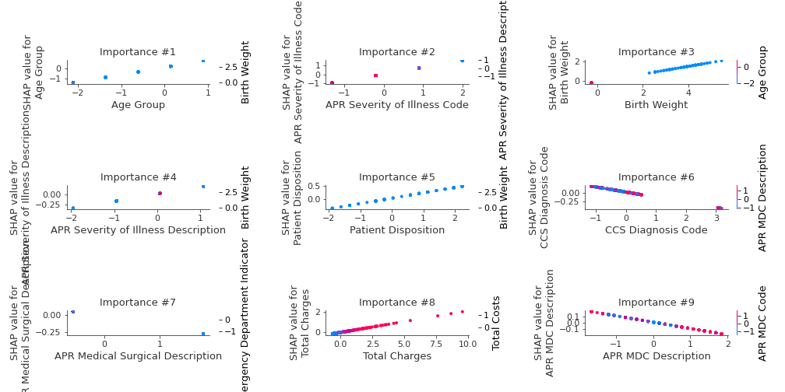
### Dependence Minor (Fold 1)
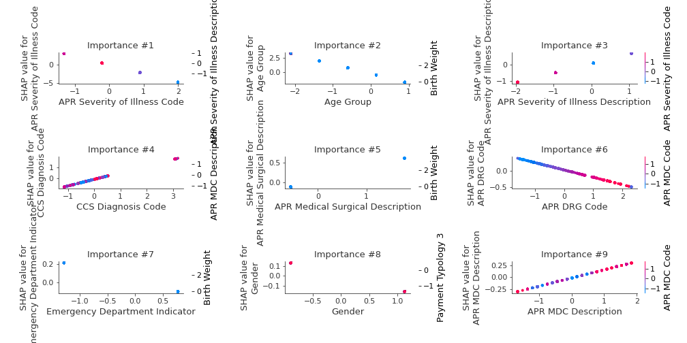
### Dependence Moderate (Fold 1)
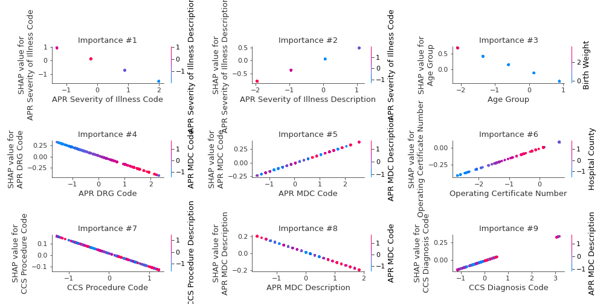

## SHAP Decision plots

### Worst decisions for selected sample 1 (Fold 1)
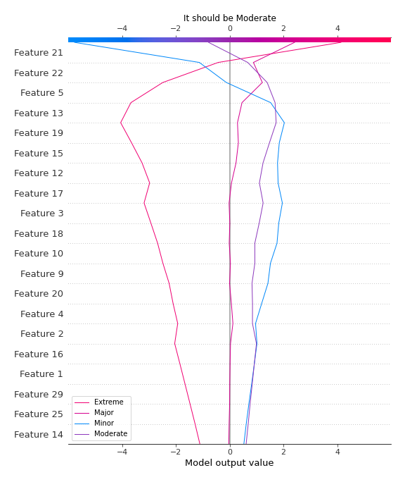
### Worst decisions for selected sample 2 (Fold 1)
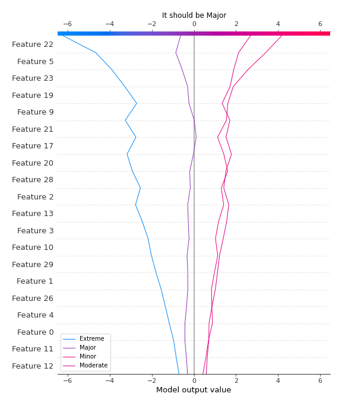
### Worst decisions for selected sample 3 (Fold 1)
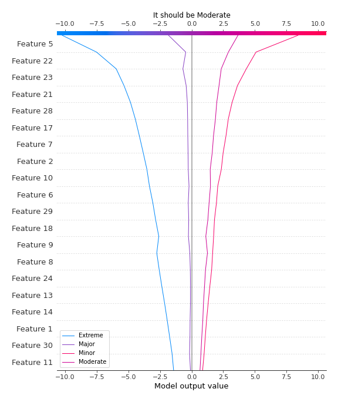
### Worst decisions for selected sample 4 (Fold 1)
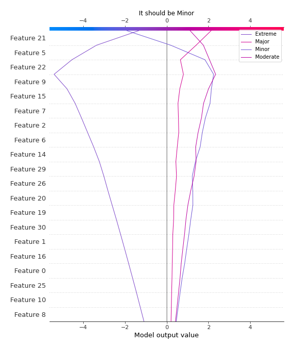
### Best decisions for selected sample 1 (Fold 1)

### Best decisions for selected sample 2 (Fold 1)
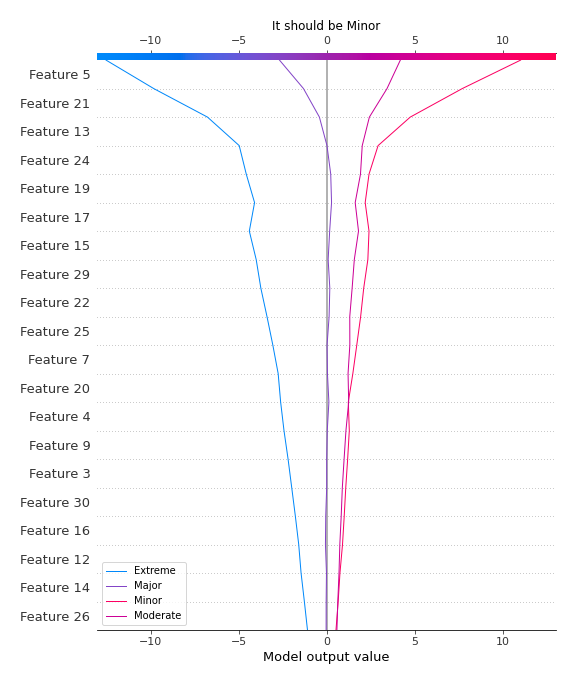
### Best decisions for selected sample 3 (Fold 1)
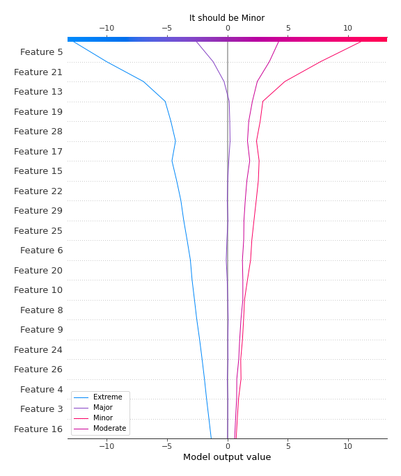
### Best decisions for selected sample 4 (Fold 1)
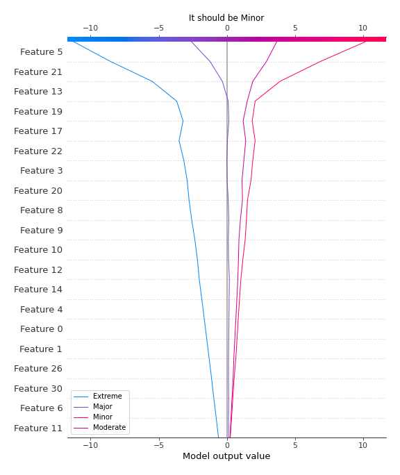

[<< Go back](../README.md)
