# Summary of 4_Default_Xgboost

[<< Go back](../README.md)

## Extreme Gradient Boosting (Xgboost)
- **n_jobs**: -1
- **objective**: multi:softprob
- **eta**: 0.075
- **max_depth**: 6
- **min_child_weight**: 1
- **subsample**: 1.0
- **colsample_bytree**: 1.0
- **eval_metric**: mlogloss
- **num_class**: 4
- **explain_level**: 2

## Validation
 - **validation_type**: split
 - **train_ratio**: 0.75
 - **shuffle**: True
 - **stratify**: True

## Optimized metric
logloss

## Training time

23.8 seconds

### Metric details
|           |   Extreme |      Major |      Minor |   Moderate |   accuracy |   macro avg |   weighted avg |   logloss |
|:----------|----------:|-----------:|-----------:|-----------:|-----------:|------------:|---------------:|----------:|
| precision |  0.641304 |   0.608871 |   0.84984  |   0.616788 |   0.734677 |    0.679201 |       0.728692 |  0.614364 |
| recall    |  0.710843 |   0.616327 |   0.894118 |   0.533123 |   0.734677 |    0.688603 |       0.734677 |  0.614364 |
| f1-score  |  0.674286 |   0.612576 |   0.871417 |   0.571912 |   0.734677 |    0.682548 |       0.730513 |  0.614364 |
| support   | 83        | 245        | 595        | 317        |   0.734677 | 1240        |    1240        |  0.614364 |

## Confusion matrix
|                     |   Predicted as Extreme |   Predicted as Major |   Predicted as Minor |   Predicted as Moderate |
|:--------------------|-----------------------:|---------------------:|---------------------:|------------------------:|
| Labeled as Extreme  |                     59 |                   22 |                    0 |                       2 |
| Labeled as Major    |                     30 |                  151 |                    9 |                      55 |
| Labeled as Minor    |                      1 |                   14 |                  532 |                      48 |
| Labeled as Moderate |                      2 |                   61 |                   85 |                     169 |

## Learning curves
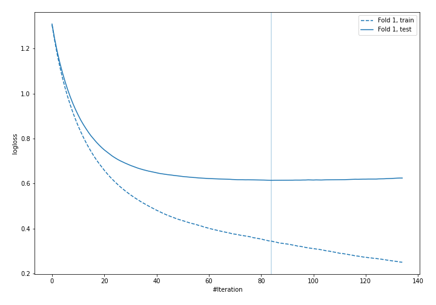

## Permutation-based Importance
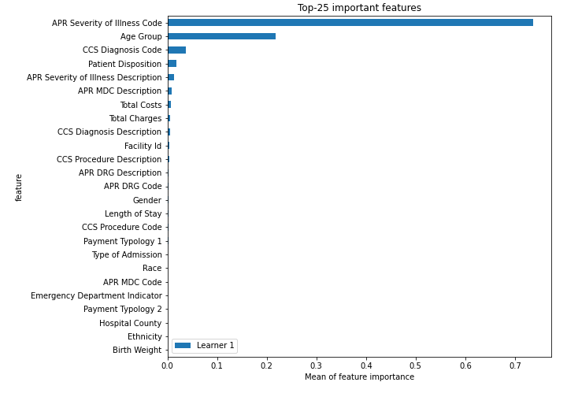
## Confusion Matrix

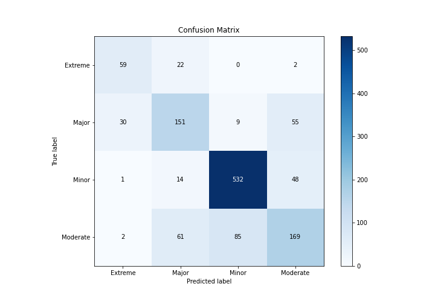

## Normalized Confusion Matrix

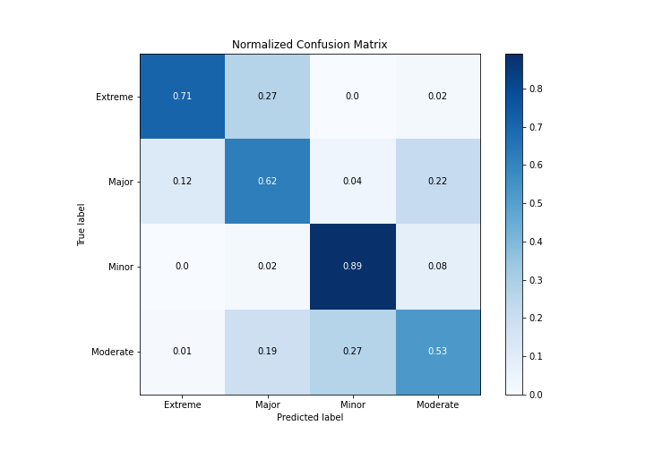

## ROC Curve

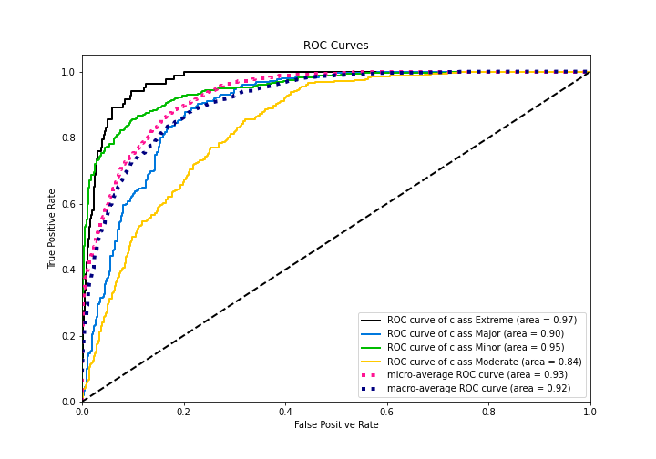

## Precision Recall Curve

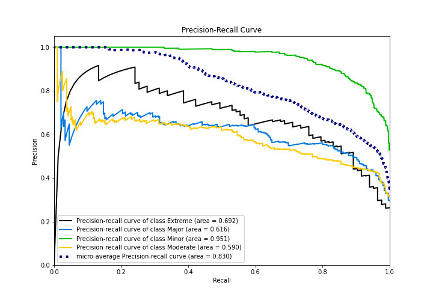

## SHAP Importance
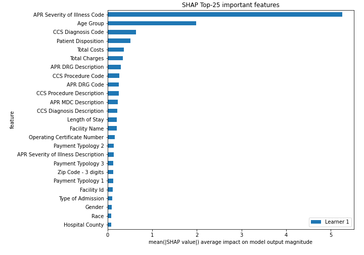

## SHAP Dependence plots

### Dependence Extreme (Fold 1)
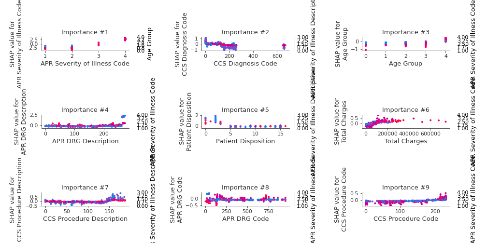
### Dependence Major (Fold 1)
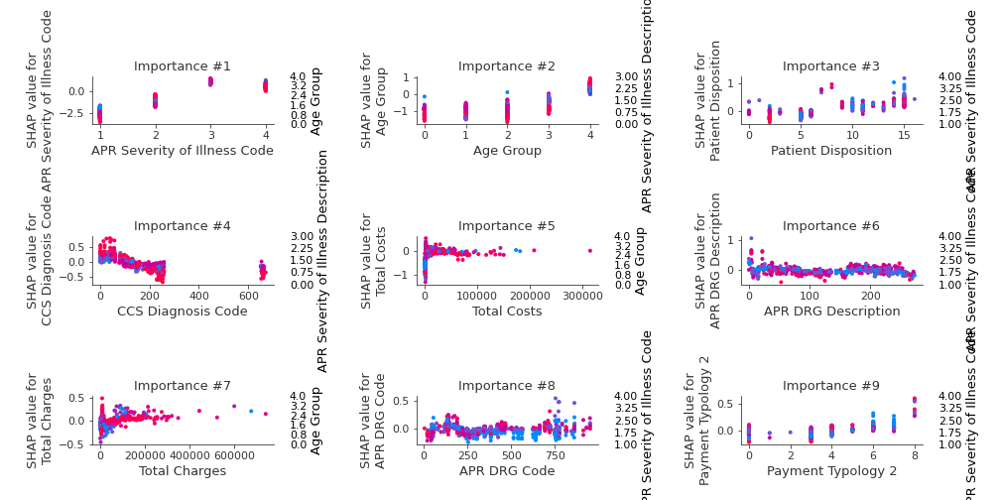
### Dependence Minor (Fold 1)
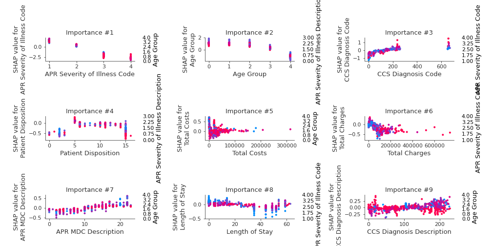
### Dependence Moderate (Fold 1)
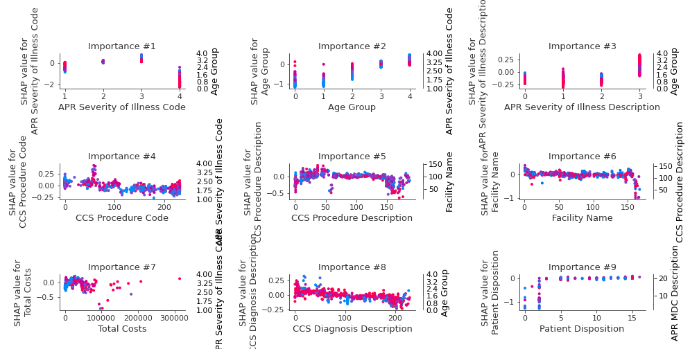

## SHAP Decision plots

### Worst decisions for selected sample 1 (Fold 1)
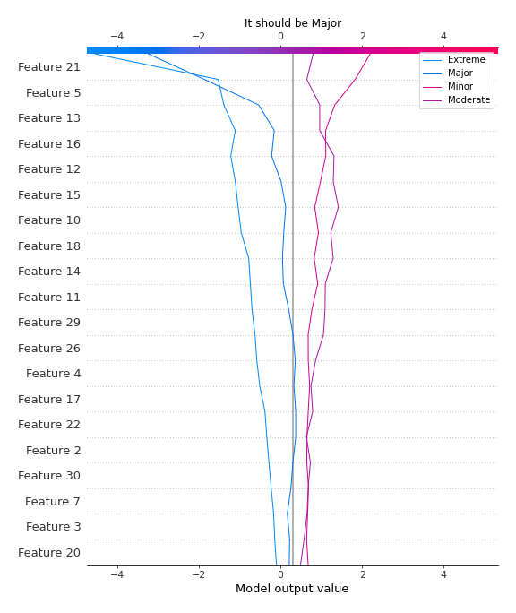
### Worst decisions for selected sample 2 (Fold 1)
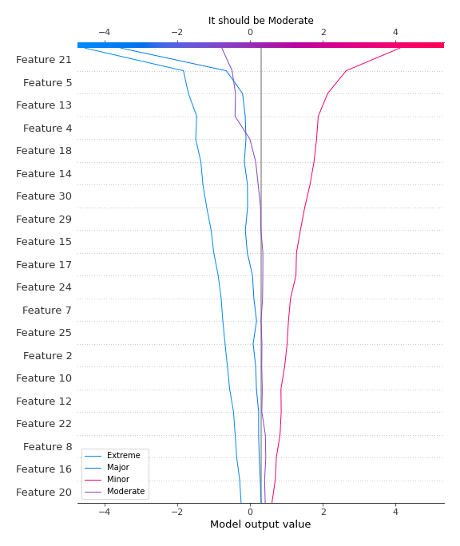
### Worst decisions for selected sample 3 (Fold 1)
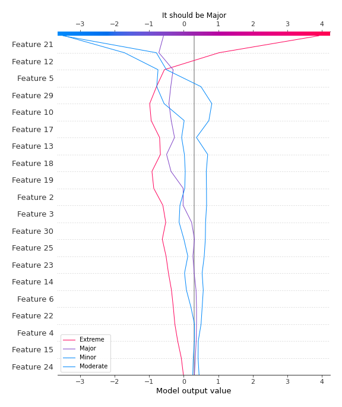
### Worst decisions for selected sample 4 (Fold 1)
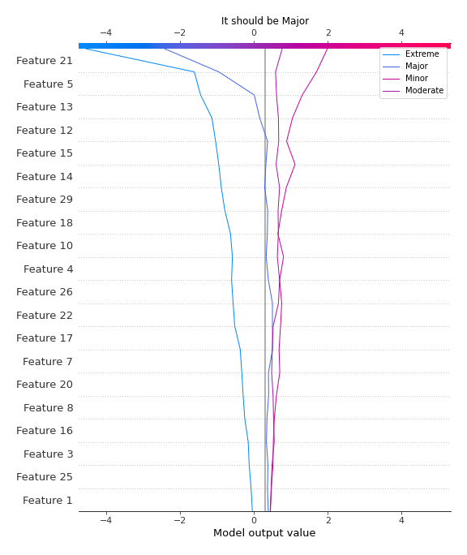
### Best decisions for selected sample 1 (Fold 1)

### Best decisions for selected sample 2 (Fold 1)
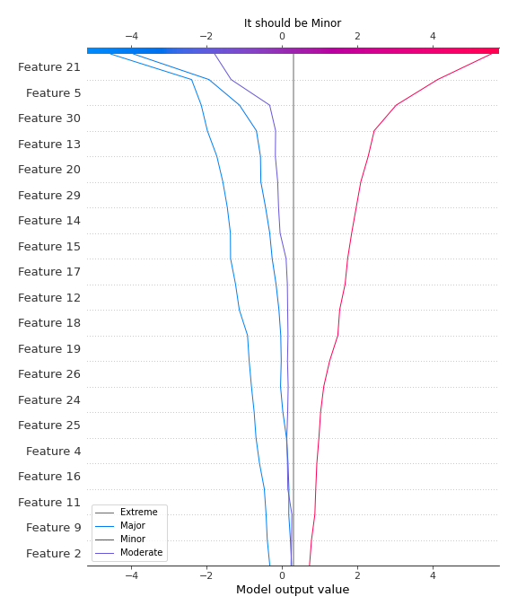
### Best decisions for selected sample 3 (Fold 1)
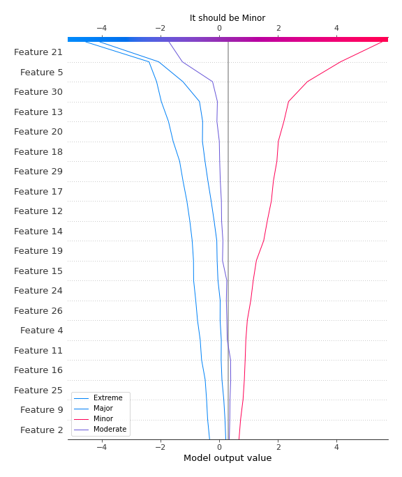
### Best decisions for selected sample 4 (Fold 1)
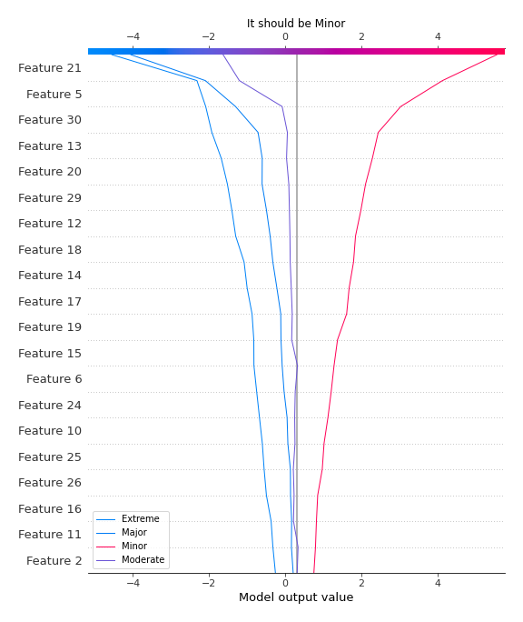

[<< Go back](../README.md)
