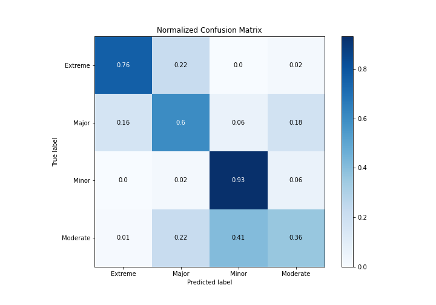

# Summary of 5_Default_NeuralNetwork

[<< Go back](../README.md)

## Neural Network
- **n_jobs**: -1
- **dense_1_size**: 32
- **dense_2_size**: 16
- **learning_rate**: 0.05
- **num_class**: 4
- **explain_level**: 2

## Validation
 - **validation_type**: split
 - **train_ratio**: 0.75
 - **shuffle**: True
 - **stratify**: True

## Optimized metric
logloss

## Training time

2.6 seconds

### Metric details
|           |   Extreme |      Major |      Minor |   Moderate |   accuracy |   macro avg |   weighted avg |   logloss |
|:----------|----------:|-----------:|-----------:|-----------:|-----------:|------------:|---------------:|----------:|
| precision |  0.6      |   0.601626 |   0.791667 |   0.585492 |   0.705645 |    0.644696 |       0.688582 |   0.69787 |
| recall    |  0.759036 |   0.604082 |   0.92605  |   0.356467 |   0.705645 |    0.661409 |       0.705645 |   0.69787 |
| f1-score  |  0.670213 |   0.602851 |   0.853602 |   0.443137 |   0.705645 |    0.642451 |       0.68685  |   0.69787 |
| support   | 83        | 245        | 595        | 317        |   0.705645 | 1240        |    1240        |   0.69787 |

## Confusion matrix
|                     |   Predicted as Extreme |   Predicted as Major |   Predicted as Minor |   Predicted as Moderate |
|:--------------------|-----------------------:|---------------------:|---------------------:|------------------------:|
| Labeled as Extreme  |                     63 |                   18 |                    0 |                       2 |
| Labeled as Major    |                     38 |                  148 |                   14 |                      45 |
| Labeled as Minor    |                      2 |                    9 |                  551 |                      33 |
| Labeled as Moderate |                      2 |                   71 |                  131 |                     113 |

## Learning curves

## Permutation-based Importance

## Confusion Matrix

## Normalized Confusion Matrix

## ROC Curve

## Precision Recall Curve

[<< Go back](../README.md)
