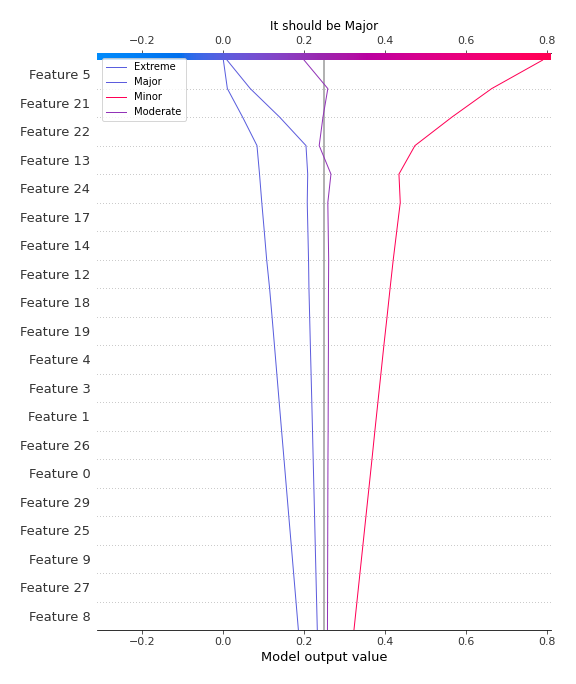

# Summary of 6_Default_RandomForest

[<< Go back](../README.md)

## Random Forest
- **n_jobs**: -1
- **criterion**: gini
- **max_features**: 0.9
- **min_samples_split**: 30
- **max_depth**: 4
- **eval_metric_name**: logloss
- **num_class**: 4
- **explain_level**: 2

## Validation
 - **validation_type**: split
 - **train_ratio**: 0.75
 - **shuffle**: True
 - **stratify**: True

## Optimized metric
logloss

## Training time

27.7 seconds

### Metric details
|           |   Extreme |      Major |      Minor |   Moderate |   accuracy |   macro avg |   weighted avg |   logloss |
|:----------|----------:|-----------:|-----------:|-----------:|-----------:|------------:|---------------:|----------:|
| precision |  0.619048 |   0.677419 |   0.844302 |   0.570552 |   0.728226 |    0.67783  |       0.726269 |  0.624269 |
| recall    |  0.783133 |   0.514286 |   0.884034 |   0.586751 |   0.728226 |    0.692051 |       0.728226 |  0.624269 |
| f1-score  |  0.691489 |   0.584687 |   0.863711 |   0.578538 |   0.728226 |    0.679606 |       0.72415  |  0.624269 |
| support   | 83        | 245        | 595        | 317        |   0.728226 | 1240        |    1240        |  0.624269 |

## Confusion matrix
|                     |   Predicted as Extreme |   Predicted as Major |   Predicted as Minor |   Predicted as Moderate |
|:--------------------|-----------------------:|---------------------:|---------------------:|------------------------:|
| Labeled as Extreme  |                     65 |                   15 |                    0 |                       3 |
| Labeled as Major    |                     35 |                  126 |                    8 |                      76 |
| Labeled as Minor    |                      3 |                    5 |                  526 |                      61 |
| Labeled as Moderate |                      2 |                   40 |                   89 |                     186 |

## Learning curves

## Permutation-based Importance

## Confusion Matrix

## Normalized Confusion Matrix

## ROC Curve

## Precision Recall Curve

## SHAP Importance

## SHAP Dependence plots

### Dependence Extreme (Fold 1)

### Dependence Major (Fold 1)

### Dependence Minor (Fold 1)

### Dependence Moderate (Fold 1)

## SHAP Decision plots

### Worst decisions for selected sample 1 (Fold 1)

### Worst decisions for selected sample 2 (Fold 1)

### Worst decisions for selected sample 3 (Fold 1)

### Worst decisions for selected sample 4 (Fold 1)

### Best decisions for selected sample 1 (Fold 1)

### Best decisions for selected sample 2 (Fold 1)

### Best decisions for selected sample 3 (Fold 1)

### Best decisions for selected sample 4 (Fold 1)

[<< Go back](../README.md)
