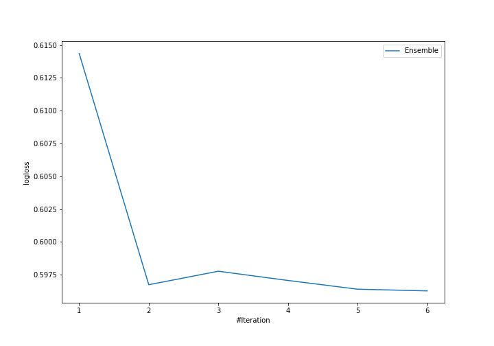
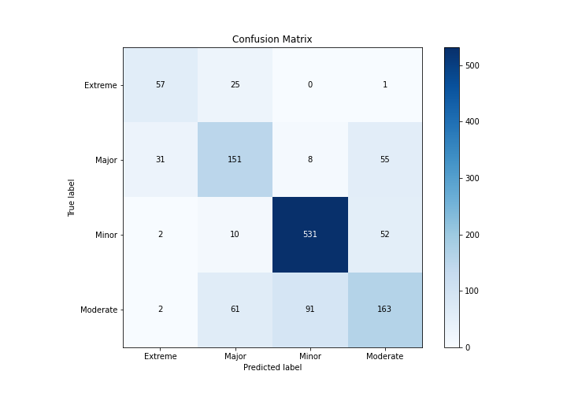
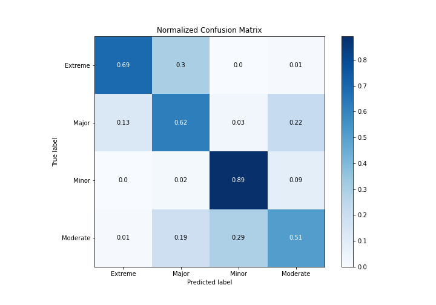
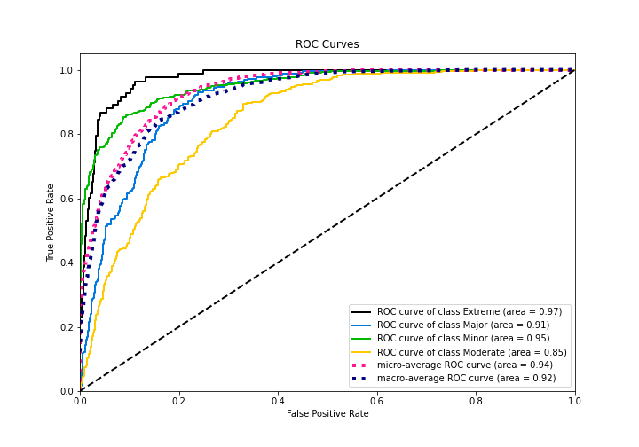
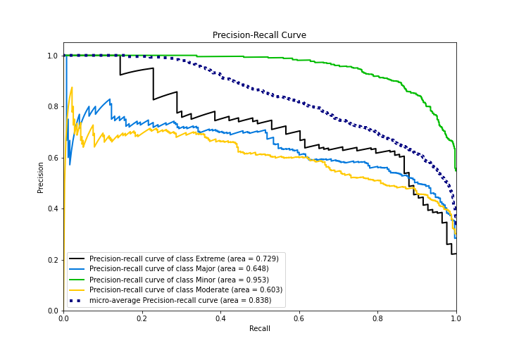

# Summary of Ensemble

[<< Go back](../README.md)

## Ensemble structure
| Model                  |   Weight |
|:-----------------------|---------:|
| 3_Linear               |        2 |
| 4_Default_Xgboost      |        3 |
| 6_Default_RandomForest |        1 |

### Metric details
|           |   Extreme |      Major |      Minor |   Moderate |   accuracy |   macro avg |   weighted avg |   logloss |
|:----------|----------:|-----------:|-----------:|-----------:|-----------:|------------:|---------------:|----------:|
| precision |  0.619565 |   0.611336 |   0.842857 |   0.601476 |   0.727419 |    0.668809 |       0.720459 |  0.596263 |
| recall    |  0.686747 |   0.616327 |   0.892437 |   0.514196 |   0.727419 |    0.677427 |       0.727419 |  0.596263 |
| f1-score  |  0.651429 |   0.613821 |   0.866939 |   0.554422 |   0.727419 |    0.671653 |       0.722609 |  0.596263 |
| support   | 83        | 245        | 595        | 317        |   0.727419 | 1240        |    1240        |  0.596263 |

## Confusion matrix
|                     |   Predicted as Extreme |   Predicted as Major |   Predicted as Minor |   Predicted as Moderate |
|:--------------------|-----------------------:|---------------------:|---------------------:|------------------------:|
| Labeled as Extreme  |                     57 |                   25 |                    0 |                       1 |
| Labeled as Major    |                     31 |                  151 |                    8 |                      55 |
| Labeled as Minor    |                      2 |                   10 |                  531 |                      52 |
| Labeled as Moderate |                      2 |                   61 |                   91 |                     163 |

## Learning curves

## Confusion Matrix

## Normalized Confusion Matrix

## ROC Curve

## Precision Recall Curve

[<< Go back](../README.md)
